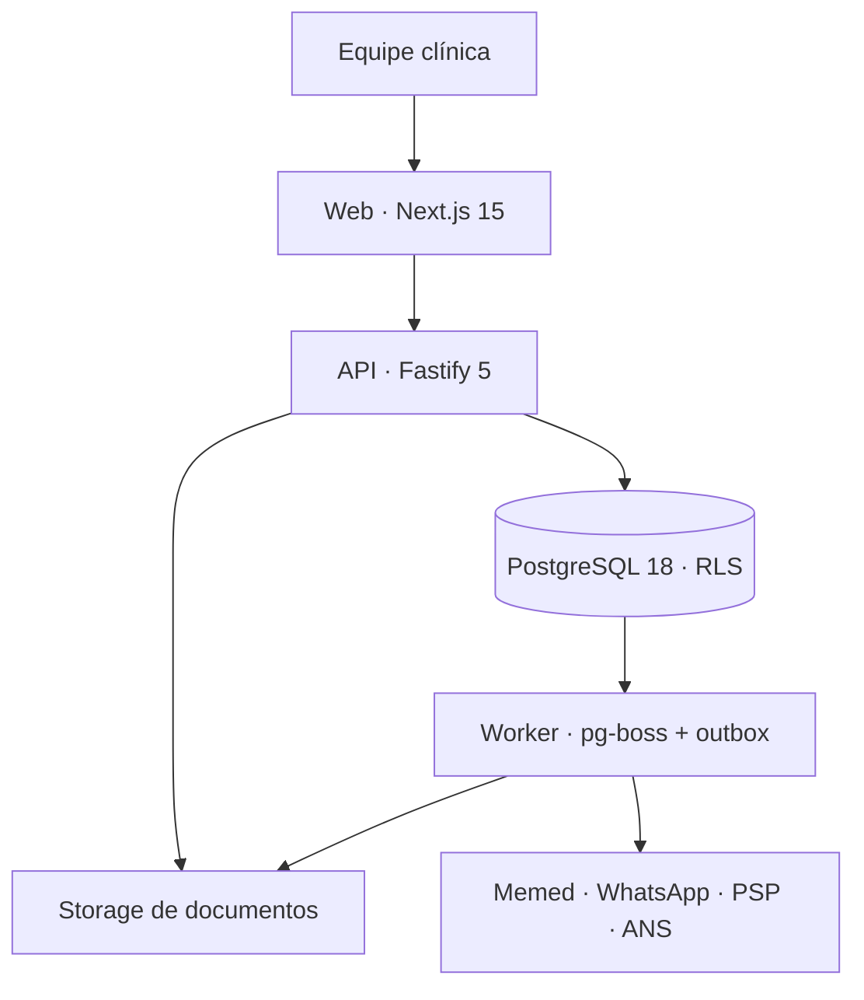

<div align="center">
  <a href="https://cadencia-nine.vercel.app/entrar">
    
  </a>

  <h1>Cadência</h1>

  <p><strong>O sistema operacional da clínica brasileira.</strong></p>
  <p>
    Agenda, prontuário, relacionamento, financeiro e TISS no mesmo ritmo —<br />
    com segurança clínica como regra do banco, não promessa da interface.
  </p>

  <p>
    <a href="https://cadencia-nine.vercel.app/entrar"><strong>Explorar a demonstração →</strong></a>
    ·
    <a href="#rodando-localmente">Rodar localmente</a>
    ·
    <a href="docs/superpowers/specs/2026-08-03-design-sistema.md">Ler o design</a>
  </p>

  <p>
    <a href="https://github.com/felipemenezes25000-spec/cadencia/actions/workflows/ci.yml"></a>
    
    
    
    
  </p>
</div>

---

> A clínica não é organizada por módulos. Ela é organizada por ritmo: o que está acontecendo agora, quem precisa de atenção e qual é a próxima ação. O Cadência existe para acompanhar esse compasso — sem fazer a equipe esperar pelo software.

## Em um minuto

O **Cadência** é um SaaS multi-tenant de prontuário eletrônico e gestão para clínicas médicas brasileiras de 1 a 30 profissionais, atendendo particular e convênio.

Ele reúne o dia inteiro da clínica em uma única operação:

| O dia | O cuidado | A operação | A receita |
|---|---|---|---|
| Cockpit “Hoje”, agenda semanal, recorrências e lista de espera | Prontuário versionado, autosave, documentos, anexos, prescrições e catálogos clínicos | Pacientes, equipe, permissões, auditoria, WhatsApp, automações e NPS | Caixa, contas, recebimentos, repasses, estoque, relatórios e ciclo TISS |

O diferencial não é apenas ter mais telas. É tratar as obrigações difíceis — isolamento entre clínicas, imutabilidade do registro finalizado, trilha auditável, retenção, dinheiro e tempo — como **invariantes verificáveis**, desde a primeira migration.

## Experimente agora

A demonstração pública nasce com uma clínica fictícia completa: equipe, pacientes, agenda em diferentes estados, atendimentos, conversas, caixa, estoque, convênios, guias, lote, demonstrativo e glosas.

<div align="center">
  <a href="https://cadencia-nine.vercel.app/entrar"><strong>Abrir a Clínica Aurora →</strong></a>
</div>

| Campo | Valor |
|---|---|
| E-mail | `helena@aurora.demo` |
| Senha | `Cadencia@2026` |
| Perfil | Administração clínica |

<details>
<summary>Outros perfis da demonstração</summary>

Todos usam a senha `Cadencia@2026`.

| E-mail | Papel |
|---|---|
| `rafael@aurora.demo` | Profissional |
| `juliana@aurora.demo` | Recepção |
| `marcos@aurora.demo` | Financeiro |

</details>

> [!IMPORTANT]
> Este ambiente contém **somente dados fictícios** e não é a produção clínica de referência. A demonstração publicada roda em modo `memed`: prescrições usam a integração real da Memed e a assistência de transcrição usa OpenAI; mensagens, pagamentos e assinatura de atestados continuam sem provedor real contratado. Nunca cadastre pacientes reais neste ambiente.

## Feito para o trabalho real

### Fluxo clínico sem trocar de contexto

- Cockpit operacional com agora, próximo, atrasos e pendências.
- Agenda semanal com drag-and-drop, recorrências, encaixes e lista de espera.
- Prontuário com rascunho, autosave, versões, adendos e finalização imutável.
- Prescrições, atestados, PDFs, anexos e compartilhamento controlado.
- Busca de CID-10, CID-11, TUSS e bulas no próprio fluxo de atendimento.

### Relacionamento no número da clínica

- Caixa de entrada bidirecional para WhatsApp.
- Confirmações, lembretes, pós-consulta e NPS automatizados.
- Webhooks validados por HMAC e processamento idempotente.
- Outbox transacional: a mensagem nasce junto com o evento de domínio e é enviada pelo worker.

### Gestão que conversa com o prontuário

- Contas a pagar e receber, caixa, conciliação e recibos sequenciais.
- Regras de repasse, fornecedores, centros de custo e estoque.
- Indicadores operacionais, financeiros, NPS e exploração de visões.
- Dinheiro sempre em centavos inteiros — nunca em ponto flutuante.

### Convênios de ponta a ponta

- Operadoras, carteirinhas, guias de consulta e SP/SADT.
- Lotes, XML TISS, transporte por arquivo ou SOAP e retornos.
- Demonstrativos, glosas e recursos com reprodução do contexto original.
- Reprojeção de guia após retificação do atendimento.

## Uma fundação difícil de copiar

| Garantia | Como o Cadência sustenta |
|---|---|
| **Isolamento multi-tenant** | `tenant_id`, RLS habilitada e forçada, policies e chaves estrangeiras compostas. Uma suíte exclusiva tenta atravessar a fronteira entre clínicas. |
| **Registro clínico imutável** | Depois de finalizado, o registro é append-only. Correções criam novas versões; não reescrevem o passado. |
| **Auditoria útil e segura** | Trilha separada do dado clínico, append-only e selada. Ausência de execução também vira sinal observável. |
| **Tempo correto** | O PostgreSQL é a fonte do tempo persistido; datas operacionais respeitam o fuso da clínica. |
| **Integrações resilientes** | Outbox transacional, worker, filas duráveis, idempotência e adaptadores fake/real explícitos. |
| **Arquitetura sem ciclos** | O grafo de módulos é um DAG verificado no CI: setas só descem e pacote irmão não importa pacote irmão. |
| **Privacidade por padrão** | Respostas com dados pessoais usam `no-store`; web não acessa o banco; segredos não entram no repositório. |

O projeto não se declara “compliance pronto” por marketing. Ele transforma requisitos brasileiros em mecanismos concretos e testáveis, mantendo as decisões e suas justificativas versionadas no [design do sistema](docs/superpowers/specs/2026-08-03-design-sistema.md).

## Arquitetura



Três fronteiras são deliberadas:

1. **Somente API e worker acessam o banco.** O frontend fala HTTP e não recebe `DATABASE_URL`.
2. **Parceiros são chamados pelo worker.** O caminho normal passa pelo outbox; uma exceção síncrona precisa ser explícita e limitada.
3. **Webhooks têm sua própria raiz de confiança.** HMAC e contratos próprios substituem “rotas mágicas” liberadas no middleware de sessão.

O monorepo segue quatro camadas:

```text
L3  apps        web · api · worker
L2  operação    agenda · prontuário · documentos · financeiro · TISS · mensagens
L1  cadastros   identidade · clínicas · pessoas · pacientes · catálogos
L0  plataforma  kernel · banco · auditoria · auth · storage · jobs · eventos
```

Composição entre módulos irmãos acontece em `apps/`; contratos assíncronos vivem em `packages/events`. O [`dependency-cruiser`](.dependency-cruiser.cjs) transforma essa intenção em gate de CI.

## Rodando localmente

Esta seção é apenas para desenvolvimento. A [demonstração pública](https://cadencia-nine.vercel.app/entrar) não depende do Docker da máquina de quem acessa: o navegador fala com a Vercel, e a Vercel encaminha `/v1/*` para a API na AWS.

### Pré-requisitos

| Ferramenta | Versão |
|---|---:|
| Node.js | `>= 24` |
| pnpm | `10.28.2` |
| Docker + Compose | versão atual, somente para desenvolvimento local |

### 1. Instale as dependências

```bash
git clone https://github.com/felipemenezes25000-spec/cadencia.git
cd cadencia

corepack enable
corepack prepare pnpm@10.28.2 --activate
pnpm install --frozen-lockfile
```

### 2. Prepare o ambiente e o banco

```bash
cp .env.example .env

# Gere a chave e copie a saída para CADENCIA_TOTP_KEY no arquivo .env
node -e "console.log(require('node:crypto').randomBytes(32).toString('base64'))"

pnpm db:up
pnpm db:migrate
pnpm authz:seed
```

O compose de desenvolvimento publica o PostgreSQL apenas em `127.0.0.1:5433` e usa os três papéis do runtime: `api`, `jobs` e `postgres` para migrations.

### 3. Crie a clínica de demonstração

```bash
pnpm exec tsx --env-file=.env scripts/semear-demo.ts
```

A semente é idempotente para os dados operacionais e preserva o histórico clínico imutável. Para zerar todo o ambiente, recrie o volume do banco com `pnpm db:reset` e rode as migrations novamente.

### 4. Inicie a aplicação

Em terminais separados:

```bash
# API · http://localhost:3001
pnpm --filter @cadencia/api dev

# Web · http://localhost:3000
pnpm --filter @cadencia/web dev

# Worker · necessário para filas e automações
pnpm --filter @cadencia/worker exec tsx src/worker.ts
```

Pontos úteis depois do boot:

- Aplicação: <http://localhost:3000>
- Saúde da API: <http://localhost:3001/health>
- Contrato OpenAPI: <http://localhost:3001/openapi.json>

## Operação da demonstração publicada

A URL pública é <https://cadencia-nine.vercel.app>. O frontend roda na Vercel e mantém navegador, cookies e API na mesma origem; o rewrite de `/v1/*` usa `API_ORIGIN` para alcançar a instância Lightsail `cadencia-server-new`, em `sa-east-1`.

Na instância, o PostgreSQL 18 roda no container `cadencia-db`. API e worker são serviços supervisionados pelo systemd:

```bash
systemctl status cadencia-api cadencia-worker
journalctl -u cadencia-api -u cadencia-worker --since today
```

No Compose de produção, o serviço one-shot `bootstrap` aplica migrations, define
as senhas dos papéis, sincroniza o catálogo de ações e prepara o pg-boss antes de
liberar API e worker. Depois de atualização do código, o deploy só está concluído
quando todas estas verificações passam:

```bash
# Na instância AWS
pnpm exec tsx --env-file=.env scripts/semear-demo.ts
pnpm exec tsx --env-file=.env scripts/memed-check.ts
sudo systemctl restart cadencia-api cadencia-worker
curl -fsS http://127.0.0.1:3001/health
```

Por fim, teste o login pela URL pública com `helena@aurora.demo` e confirme que a escolha da unidade abre `/hoje`. Um `GET /v1/sessao` anônimo retornar `401` prova apenas que a API está acessível; não prova que as contas da demonstração foram semeadas.

Os segredos pertencem ao `.env` da instância, com permissão `0600`. A Vercel recebe somente `API_ORIGIN`; chaves de banco, AWS, Memed, OpenAI e CID-11 nunca entram em variável `NEXT_PUBLIC_*` nem no repositório.

## Qualidade como contrato

O pre-push local executa o mesmo tipo de rede de segurança que protege a `main` no GitHub Actions.

| Comando | O que prova |
|---|---|
| `pnpm typecheck` | TypeScript estrito no backend e frontend |
| `pnpm test` | Unidades, domínios e guardas arquiteturais |
| `pnpm test:web` | Componentes e fluxos React em jsdom |
| `pnpm build:web` | O bundle de produção realmente fecha |
| `pnpm test:int` | Integração contra PostgreSQL 18 real |
| `pnpm test:iso` | Isolamento multi-tenant em banco descartável |
| `pnpm db:invariants --with-crud` | Invariantes estruturais e privilégios do banco |
| `pnpm arch:check` | Camadas, ciclos e importações proibidas |
| `pnpm prepush` | Gate completo antes de publicar |

> [!TIP]
> As suítes de integração e isolamento precisam de Docker. O CI instala Chromium para validar também a geração de PDFs.

## Mapa do repositório

```text
cadencia/
├── apps/
│   ├── web/              # Next.js, telas e design system
│   ├── api/              # Fastify, sessão, contratos e composição
│   └── worker/           # jobs, outbox, integrações e rotinas agendadas
├── packages/
│   ├── db/               # transações, migrations e invariantes
│   ├── authn · authz/    # identidade, sessão, MFA e autorização
│   ├── emr · documents/  # prontuário, artefatos e PDFs
│   ├── scheduling/       # agenda, recorrências e lista de espera
│   ├── messaging/        # conversas e automações
│   ├── billing · payments · inventory · reports/
│   ├── tiss/             # guias, lotes, XML, glosas e SOAP
│   └── ...               # plataforma e demais domínios independentes
├── db/init/               # bootstrap do PostgreSQL local
├── scripts/               # carga de catálogos, seed e drills
├── tools/                 # lints e verificações específicas do projeto
└── docs/                  # pesquisa, decisões, specs e planos executáveis
```

## Regras para evoluir sem quebrar a fundação

Antes de uma mudança estrutural, leia as [decisões irreversíveis do design](docs/superpowers/specs/2026-08-03-design-sistema.md#10-decisões-irreversíveis).

1. **Migrations são forward-only.** Uma migration aplicada nunca é editada; correção entra na próxima.
2. **Pacote irmão não importa pacote irmão.** A composição pertence à camada de aplicação.
3. **Toda tabela de negócio nasce isolada.** `tenant_id`, RLS forçada, policy e FK composta entram juntas.
4. **Registro finalizado não é apagado nem alterado.** Retificação ou adendo gera uma nova versão.
5. **Tempo persistido vem do banco.** Não espalhe `Date.now()` pelo domínio.
6. **Exceções são declaradas onde a garantia vive.** Nunca enfraqueça um teste com uma allowlist conveniente.

## Documentação

| Documento | Para quê serve |
|---|---|
| [Design do sistema](docs/superpowers/specs/2026-08-03-design-sistema.md) | Tese, arquitetura, dados, riscos e decisões fundadoras |
| [Design system](apps/web/DESIGN_SYSTEM.md) | Identidade visual, tokens e padrões de interação |
| [Catálogos clínicos](docs/catalogos-clinicos.md) | Estratégia de CID-10, CID-11 e referências |
| [Ambiente de demonstração](docs/superpowers/specs/2026-08-10-ambiente-de-demonstracao-design.md) | Topologia, limites, custo e guardas do demo |
| [Pesquisa de domínio](docs/superpowers/pesquisa/2026-08-03-dossie-dominio-pep-brasil.md) | Base regulatória e operacional do PEP brasileiro |
| [Pipeline de CI](.github/workflows/ci.yml) | Gates estáticos, integração e isolamento |

## Ambientes

| Ambiente | Topologia | Pode conter dado real? |
|---|---|---:|
| Local | Docker Compose + processos Node | **Não** |
| Demonstração publicada | Vercel → Lightsail `cadencia-server-new` em São Paulo → API/worker (systemd) + PostgreSQL 18 (Docker) | **Não** |
| Referência de produção | ALB/WAF → ECS Fargate → RDS Multi-AZ + S3/KMS em `sa-east-1` | Somente após implantação e validação das salvaguardas documentadas |

## Licença

Este repositório ainda **não publica uma licença de uso**. Código publicamente visível não é, por si só, código licenciado para cópia, modificação ou distribuição. Entre em contato com o [responsável pelo projeto](https://github.com/felipemenezes25000-spec) antes de reutilizá-lo.

---

<div align="center">
  <strong>Cadência</strong><br />
  Feito no Brasil para quem cuida no Brasil.
</div>
